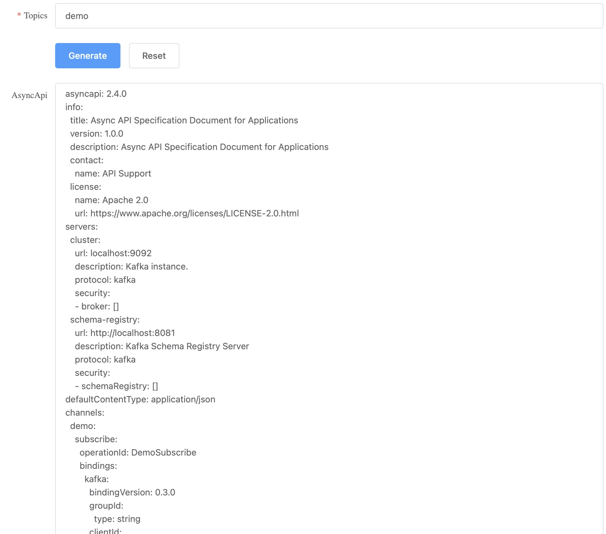

# Cli to Generate AsyncApi Specification from Kafka

## Setup
- Kafka Cluster
- SchemaRegistry Cluster

### Security Config

#### Zookeeper Auth
**config/zookeeper.properties**
```properties
dataDir=/tmp/zookeeper
clientPort=2181
maxClientCnxns=0
admin.enableServer=false
authProvider.1=org.apache.zookeeper.server.auth.SASLAuthenticationProvider
requireClientAuthScheme=sasl
jaasLoginRenew=3600000
```

**config/zk_jaas.conf**
```
Server {
   org.apache.kafka.common.security.plain.PlainLoginModule required
   username="admin"
   password="admin-secret"
   user_admin="admin-secret";
};
```

**run zk**
```shell
export KAFKA_OPTS="-Djava.security.auth.login.config=config/zk_jaas.conf"
bin/zookeeper-server-start.sh config/zookeeper.properties
```

#### Kafka Auth
**server.properties**
```properties
broker.id=0
listeners=SASL_PLAINTEXT://:9092
security.inter.broker.protocol=SASL_PLAINTEXT
sasl.mechanism.inter.broker.protocol=PLAIN
sasl.enabled.mechanisms=PLAIN
authorizer.class.name=kafka.security.authorizer.AclAuthorizer
allow.everyone.if.no.acl.found=true
auto.create.topics.enable=false
advertised.listeners=SASL_PLAINTEXT://localhost:9092
```

**config/kafka_server_jaas.conf**
```
KafkaServer {
   org.apache.kafka.common.security.plain.PlainLoginModule required
   username="admin"
   password="admin-secret"
   user_admin="admin-secret";
};

Client {
   org.apache.kafka.common.security.plain.PlainLoginModule required
   username="admin"
   password="admin-secret";
};
```

**run kafka**
```bash
export KAFKA_OPTS="-Djava.security.auth.login.config=config/kafka_server_jaas.conf"
bin/kafka-server-start.sh config/server.properties
```

#### Schema Registry Auth
**etc/schema-registry/schema-registry.properties**
```properties
listeners=http://0.0.0.0:8081
kafkastore.security.protocol=SASL_PLAINTEXT
kafkastore.sasl.mechanism=PLAIN
kafkastore.bootstrap.servers=SASL_PLAINTEXT://localhost:9092
```

**etc/schema-registry/sr_jaas.conf**
```
KafkaClient {
   org.apache.kafka.common.security.plain.PlainLoginModule required
   username="admin"
   password="admin-secret"
   user_admin="admin-secret";
};
```

**run registry**
```shell
export SCHEMA_REGISTRY_OPTS="-Djava.security.auth.login.config=etc/schema-registry/sr_jaas.conf"
bin/schema-registry-start etc/schema-registry/schema-registry.properties
```

### Init Data
```shell
# kafka broker: localhost:9092
# init kafka test topic
bin/kafka-topics.sh --bootstrap-server localhost:9092 \
    --create \
    --topic test-topic \
    --partitions 5 \
    --replication-factor 1 \
    --config retention.ms=720000 \
    --config delete.retention.ms=360000 \
    --config max.message.bytes=64000 \
    --config flush.messages=1

# schema registry cluster: http://localhost:8081
# init registry schema
curl localhost:8081/subjects/test-topic-value/versions \
    -H 'Content-Type: application/json' \
    -d '{ "schema": "{ \"type\": \"record\", \"name\": \"test-topic\", \"fields\": [ { \"type\": \"string\", \"name\": \"field1\" }, { \"type\": \"int\", \"name\": \"field2\", \"default\": 0}] }", "schemaType": "AVRO"}'    
```

## Build

### Pre-Requisites
go version go1.21.5


```bash
# for macos x64
make macos

# for linux x64
make linux

# for windows x64
make windows
```

## Run

### cli help
```
Usage:
  cli [command]

Available Commands:
  completion  Generate the autocompletion script for the specified shell
  gen         generate code
  help        Help about any command
  k2a         Export an AsyncAPI specification
  kafka       command to query topics by topic name
  ws          Start web server

Flags:
      --ca-file string        The optional certificate authority file for TLS client authentication
      --cert string           The optional certificate file for client authentication
  -d, --debug                 Display debugging output in the console. (default: false)
  -h, --help                  help for cli
      --key-file string       The optional key file for client authentication
      --kurl string           Kafka cluster broker url (default "localhost:9092")
  -p, --password string       password for kafka sasl_plaintext auth
      --rurl string           Schema registry url (default "http://localhost:8081")
      --spec-version string   Version number of the output file. (default "1.0.0")
      --tls-skip-verify       Whether to skip TLS server cert verification (default true)
      --use-tls               Use TLS to communicate with the kafka cluster
  -u, --username string       username for kafka sasl_plaintext auth

Use "cli [command] --help" for more information about a command.
```

### cli k2a help
```
Export an AsyncAPI specification for a Kafka cluster and Schema Registry.

Usage:
  cli k2a [flags]

Examples:

# no auth, local kafka, local registry
cli k2a --topics demo,sample
# no auth
cli k2a --kurl prod.kafka.com --rurl http://prod.schema-registry.com --topics demo,sample
# for SASL_PLAINTEXT
cli k2a --kurl prod.kafka.com --rurl http://prod.schema-registry.com --topics demo --username admin --password admin-secret
# SASL_SSL
...


Flags:
      --file string          Output file name (default "k2a.yaml")
      --file-format string   Output file format (default "yaml")
  -h, --help                 help for k2a
      --topics string        Topics to export

Global Flags:
      --ca-file string        The optional certificate authority file for TLS client authentication
      --cert string           The optional certificate file for client authentication
  -d, --debug                 Display debugging output in the console. (default: false)
      --key-file string       The optional key file for client authentication
      --kurl string           Kafka cluster broker url (default "localhost:9092")
  -p, --password string       password for kafka sasl_plaintext auth
      --rurl string           Schema registry url (default "http://localhost:8081")
      --spec-version string   Version number of the output file. (default "1.0.0")
      --tls-skip-verify       Whether to skip TLS server cert verification (default true)
      --use-tls               Use TLS to communicate with the kafka cluster
  -u, --username string       username for kafka sasl_plaintext auth
```

### cli generate example
```bash
cli k2a --topics test-topic

```

### cli ws help
```
Start web server to export topics

Usage:
  cli ws [flags]

Examples:

# no auth, local kafka, local schema registry
cli ws
# for SASL_PLAINTEXT
cli ws --kurl prod.kafka.com --rurl http://prod.schema-registry.com --username admin --password admin-secret
# SASL_SSL
...


Flags:
  -h, --help          help for ws
      --port string   server port to listen (default "8080")

Global Flags:
      --ca-file string        The optional certificate authority file for TLS client authentication
      --cert string           The optional certificate file for client authentication
  -d, --debug                 Display debugging output in the console. (default: false)
      --key-file string       The optional key file for client authentication
      --kurl string           Kafka cluster broker url (default "localhost:9092")
  -p, --password string       password for kafka sasl_plaintext auth
      --rurl string           Schema registry url (default "http://localhost:8081")
      --spec-version string   Version number of the output file. (default "1.0.0")
      --tls-skip-verify       Whether to skip TLS server cert verification (default true)
      --use-tls               Use TLS to communicate with the kafka cluster
  -u, --username string       username for kafka sasl_plaintext auth
```




### cli kafka help
```
command to query topics by topic name

Usage:
  cli kafka [flags]

Examples:

# no auth, local kafka, local registry
cli kafka --query test
# no auth
cli kafka --kurl prod.kafka.com --rurl http://prod.schema-registry.com --query test
# for SASL_PLAINTEXT
cli kafka --kurl prod.kafka.com --rurl http://prod.schema-registry.com --query test --username admin --password admin-secret
# SASL_SSL
...

Flags:
  -h, --help           help for kafka
      --query string   keyword in topic name

Global Flags:
      --ca-file string        The optional certificate authority file for TLS client authentication
      --cert string           The optional certificate file for client authentication
  -d, --debug                 Display debugging output in the console. (default: false)
      --key-file string       The optional key file for client authentication
      --kurl string           Kafka cluster broker url (default "localhost:9092")
  -p, --password string       password for kafka sasl_plaintext auth
      --rurl string           Schema registry url (default "http://localhost:8081")
      --spec-version string   Version number of the output file. (default "1.0.0")
      --tls-skip-verify       Whether to skip TLS server cert verification (default true)
      --use-tls               Use TLS to communicate with the kafka cluster
  -u, --username string       username for kafka sasl_plaintext auth
```

### cli gen help
```
generate code for asyncapi spec

Usage:
  cli gen [flags]

Examples:
cli gen --asyncapi-file k2a.yaml --dest-dir output

Flags:
      --artifact string          artifact id for maven project (default "sample-app")
      --asyncapi-file string     asyncapi spec file for generation
      --description string       a description for maven project (default "this is a sample app")
      --dest-dir string          output dir for generation (default "output")
      --group string             group id for maven project (default "com.sample")
  -h, --help                     help for gen
      --package-name string      package name for maven project (default "sample")
      --release-version string   parent project version for maven project (default "1.0.0")

Global Flags:
  -d, --debug                 Display debugging output in the console. (default: false)
      --kurl string           Kafka cluster broker url (default "localhost:9092")
  -p, --password string       password for kafka sasl_plaintext auth
      --rurl string           Schema registry url (default "http://localhost:8081")
      --spec-version string   Version number of the output file. (default "1.0.0")
  -u, --username string       username for kafka sasl_plaintext auth
```

#### gen result
```
output
└── sample-app
    ├── pom.xml
    └── src
        ├── main
        │   ├── java
        │   │   └── com
        │   │       └── sample
        │   │           ├── Application.java
        │   │           ├── config
        │   │           │   ├── DemoConsumerConfig.java
        │   │           │   ├── DemoConsumerProcessor.java
        │   │           │   ├── Test-repConsumerConfig.java
        │   │           │   ├── Test-repConsumerProcessor.java
        │   │           │   ├── Test-topicConsumerConfig.java
        │   │           │   └── Test-topicConsumerProcessor.java
        │   │           ├── dao
        │   │           ├── data
        │   │           │   └── mapper
        │   │           ├── domain
        │   │           ├── integration
        │   │           ├── model
        │   │           ├── processing
        │   │           │   ├── DemoConsumerProcessor.java
        │   │           │   ├── Test-repConsumerProcessor.java
        │   │           │   └── Test-topicConsumerProcessor.java
        │   │           ├── response
        │   │           ├── service
        │   │           │   ├── DemoConsumerService.java
        │   │           │   ├── Test-repConsumerService.java
        │   │           │   └── Test-topicConsumerService.java
        │   │           └── validator
        │   │               ├── CommonConsumerValidator.java
        │   │               ├── CommonProducerValidator.java
        │   │               ├── DemoConsumerValidator.java
        │   │               ├── Test-repConsumerValidator.java
        │   │               └── Test-topicConsumerValidator.java
        │   └── resources
        │       ├── api
        │       └── avro
        └── test
```

## Verify
[](https://studio.asyncapi.com/)

### Output sample
```yaml
asyncapi: 2.4.0
info:
  title: Async API Specification Document for Applications
  version: 1.0.0
  description: Async API Specification Document for Applications
  contact:
    name: API Support
  license:
    name: Apache 2.0
    url: https://www.apache.org/licenses/LICENSE-2.0.html
servers:
  cluster:
    url: localhost:9092
    description: Kafka instance.
    protocol: kafka
    security:
    - broker: []
  schema-registry:
    url: http://localhost:8081
    description: Kafka Schema Registry Server
    protocol: kafka
    security:
    - schemaRegistry: []
defaultContentType: application/json
channels:
  demo:
    subscribe:
      operationId: DemoSubscribe
      bindings:
        kafka:
          bindingVersion: 0.3.0
          groupId:
            type: string
          clientId:
            type: string
      message:
        $ref: '#/components/messages/DemoMessage'
    bindings:
      kafka:
        bindingVersion: 0.4.0
        partitions: 1
        replicas: 1
        topicConfiguration: {}
  test-rep:
    subscribe:
      operationId: TestRepSubscribe
      bindings:
        kafka:
          bindingVersion: 0.3.0
          groupId:
            type: string
          clientId:
            type: string
      message:
        $ref: '#/components/messages/TestRepMessage'
    bindings:
      kafka:
        bindingVersion: 0.4.0
        partitions: 5
        replicas: 1
        topicConfiguration:
          retention.ms: 1.2345e+07
          delete.retention.ms: 3.6e+06
          max.message.bytes: 64000
        x-configs:
          flush.messages: "1"
  test-topic:
    subscribe:
      operationId: TestTopicSubscribe
      bindings:
        kafka:
          bindingVersion: 0.3.0
          groupId:
            type: string
          clientId:
            type: string
      message:
        $ref: '#/components/messages/TestTopicMessage'
    bindings:
      kafka:
        bindingVersion: 0.4.0
        partitions: 1
        replicas: 1
        topicConfiguration:
          max.message.bytes: 64000
        x-configs:
          flush.messages: "1"
components:
  messages:
    DemoMessage:
      schemaFormat: application/schema+json;version=draft-07
      contentType: application/json
      messageId: DemoMessage
      payload:
        properties:
          name:
            type: string
        type: object
      name: DemoMessage
      bindings:
        kafka:
          bindingVersion: 0.3.0
          key:
            type: string
    TestRepMessage:
      schemaFormat: application/vnd.apache.avro;version=1.9.0
      contentType: application/avro
      messageId: TestRepMessage
      payload:
        fields:
        - name: name
          type: string
        - default: 20000
          name: money
          type: int
        name: account
        type: record
      name: TestRepMessage
      bindings:
        kafka:
          bindingVersion: 0.3.0
          key:
            type: string
    TestTopicMessage:
      schemaFormat: application/vnd.apache.avro;version=1.9.0
      contentType: application/avro
      messageId: TestTopicMessage
      payload:
        fields:
        - name: name
          type: string
        - default: 20
          name: age
          type: int
        name: test
        type: record
      name: TestTopicMessage
      bindings:
        kafka:
          bindingVersion: 0.3.0
          key:
            type: string
  securitySchemes:
    broker:
      type: userPassword
      x-configs:
        sasl.mechanisms: PLAIN
        sasl.password: '{{CLUSTER_API_SECRET}}'
        sasl.username: '{{CLUSTER_API_KEY}}'
        security.protocol: sasl_ssl
    schemaRegistry:
      type: userPassword
      x-configs:
        basic.auth.user.info: '{{SCHEMA_REGISTRY_API_KEY}}:{{SCHEMA_REGISTRY_API_SECRET}}'
```